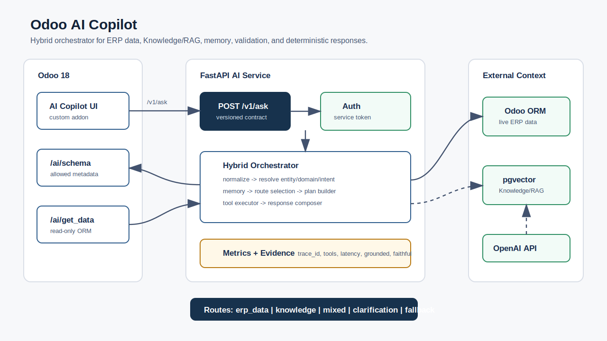
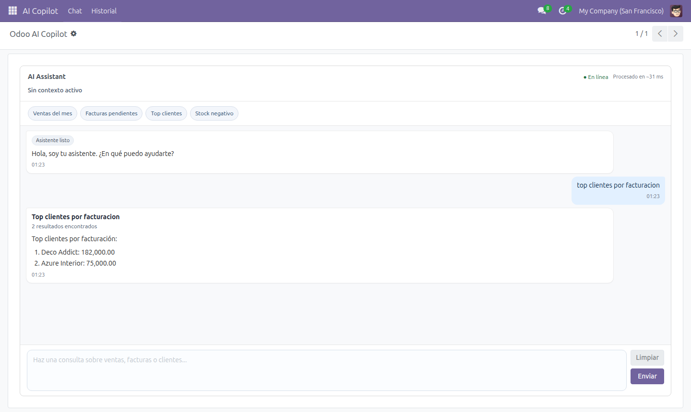

# Odoo AI Copilot


Orquestador conversacional para Odoo 18 que responde preguntas de negocio usando datos reales del ERP, memoria de sesión, herramientas de solo lectura y Knowledge/RAG opcional.

El servicio principal ya no funciona como un chatbot simple. El endpoint actual `POST /v1/ask` ejecuta un **orquestador híbrido** que entiende la pregunta, decide la ruta de resolución, construye un plan de tools, consulta Odoo o RAG según corresponda y compone una respuesta con evidencia y métricas.

## Qué resuelve

En Odoo, obtener información útil suele requerir navegar varios menús, aplicar filtros manuales o construir reportes específicos.

Este proyecto permite hacer preguntas como:

- `Cuántas ventas hay`
- `Top clientes por facturación`
- `Facturas pendientes`
- `Ventas del último mes`
- `Qué productos se vendieron en esa orden`
- `Cómo funciona la política de aprobación de compras`

y obtener respuestas basadas en datos reales del ERP o documentación indexada.

## Estado actual

- Addon Odoo `odoo_ai_assistant` integrado con el AI Service.
- AI Service expone `/v1/ask` como flujo principal.
- Orquestador con rutas `erp_data`, `knowledge`, `mixed`, `clarification` y `fallback`.
- Tools Odoo de solo lectura: `search`, `search_read`, `read`, `read_group`, `search_count`.
- Knowledge/RAG opcional con PostgreSQL + `pgvector`.
- Autenticación interna por token entre Odoo y AI Service.
- Docker Compose base y override Knowledge/RAG.
- GitHub Actions con tests Python, validación de Compose y build Docker del AI Service.

## Arquitectura



```text
Usuario
  |
  v
Odoo 18 addon: custom_addons/odoo_ai_assistant
  |
  | POST /v1/ask
  | X-AI-Service-Token
  v
FastAPI AI Service
  |
  v
Orquestador híbrido
  |
  +-- normalizer
  +-- entity_resolver
  +-- domain_resolver
  +-- intent_resolver
  +-- context_resolver / memory
  +-- route_selector
  +-- plan_builder
  +-- tool_executor
  +-- response_composer
  |
  +--> Odoo read-only tools -> /ai/schema, /ai/get_data
  |
  +--> Knowledge/RAG -> pgvector + OpenAI embeddings
```

## Flujo del orquestador

El endpoint `POST /v1/ask` sigue este flujo:

1. Normaliza la pregunta.
2. Detecta entidad, dominio e intención.
3. Resuelve contexto usando memoria de sesión para follow-ups.
4. Selecciona una ruta:
   - `erp_data`: consulta datos vivos de Odoo.
   - `knowledge`: consulta documentos indexados.
   - `mixed`: combina Odoo + documentación.
   - `clarification`: pide más contexto cuando la pregunta es ambigua.
   - `fallback`: delega al flujo legacy si no hay plan seguro.
5. Construye un plan de tools.
6. Ejecuta tools permitidas.
7. Compone una respuesta determinística cuando aplica.
8. Devuelve evidencia, fuentes, métricas, `trace_id` y memoria actualizada.

## Capacidades actuales

- Consultas de ventas, facturas, compras, productos y partners.
- Conteos, rankings, listados, agregaciones y búsquedas por estado.
- Preguntas de documentación vía Knowledge/RAG.
- Validación de políticas combinando datos ERP + documentación.
- Follow-ups usando `session_id`.
- Aclaraciones cuando falta contexto.
- Respuestas con `odoo_evidence`, `sources` y métricas de trazabilidad.

## Business Use Cases

| Área | Caso | Ruta | Tool principal |
| --- | --- | --- | --- |
| Ventas | Conteo de ventas confirmadas | `erp_data` | `query_odoo_count` |
| Facturación | Ranking de clientes por facturación | `erp_data` | `query_odoo_group` |
| Cuentas por cobrar | Facturas pendientes o vencidas | `erp_data` | `query_odoo_search` / `query_odoo_group` |
| Compras | Órdenes pendientes de recepción | `erp_data` | `query_odoo_search` |
| Operaciones | Resumen operativo del día | `erp_data` | múltiples `query_odoo_count` |
| Políticas internas | Preguntas sobre procesos y reglas | `knowledge` | `search_knowledge` |
| Compliance operativo | Validar una compra contra una política | `mixed` | Odoo tools + `search_knowledge` |

## Ejemplos

### Conteo ERP

**Usuario:** `cuantas ventas hay`

**Orquestador:** usa `query_odoo_count` sobre `sale.order`.

### Ranking ERP

**Usuario:** `top clientes por facturacion`

**Orquestador:** usa `query_odoo_group` sobre `account.move`.

### Knowledge/RAG

**Usuario:** `como funciona la politica de aprobacion de compras`

**Orquestador:** usa `search_knowledge`.

### Flujo mixto

**Usuario:** `esta compra cumple la politica de aprobacion`

**Orquestador:** consulta Odoo y contrasta con documentación indexada.

## Demo Assets



Assets versionados:

- Screenshot real del Copilot en Odoo: `docs/assets/odoo-copilot-chat.png`
- Diagrama visual: `docs/assets/architecture.svg`
- Ejemplo JSON real: `docs/examples/v1_ask_top_clients.json`

Pendientes de captura multimedia:

- GIF corto mostrando pregunta, respuesta y acciones.
- Video demo de 2-3 minutos.

Validación realizada para captura visual:

- Odoo local responde en `http://localhost:8069`.
- DB test usada: `admin`.
- Action Odoo del Copilot: `action_ai_chat_form`, id local `470`.
- Captura autenticada con Chrome headless + DevTools Protocol: OK.
- Pregunta usada en la captura: `top clientes por facturacion`.
- Respuesta renderizada: ranking de clientes por facturación con evidencia ERP.

Guion sugerido para el video demo:

1. Abrir Odoo y entrar a `AI Copilot > Chat`.
2. Preguntar `cuantas ventas hay`.
3. Preguntar `top clientes por facturacion`.
4. Mostrar evidencia/métricas de la respuesta.
5. Abrir una venta o factura desde el contexto.
6. Cerrar explicando que las consultas ERP son de solo lectura y las rutas determinísticas usan 0 tokens LLM.

## Ejecución local

1. Copia `.env.example` a `.env` y ajusta valores locales.

```bash
cp .env.example .env
```

2. Levanta el stack base:

```bash
docker compose up -d --build
```

3. Para levantar Knowledge/RAG con `pgvector`:

```bash
docker compose --env-file .env -f docker-compose.yaml -f odoo_ai_service/docker-compose.knowledge.yaml up -d --build db_knowledge ai_service
```

En `.env.example` los contenedores usan nombres de prueba para evitar choques con otros stacks:

- `odoo18_web_test`
- `odoo18_db_test`
- `ai_service_test`
- `ai_knowledge_db_test`

Puertos de prueba:

- Odoo: `http://localhost:8069`
- AI Service: `http://localhost:8001`
- Knowledge DB: `localhost:5434`

Health check:

```bash
curl -s http://localhost:8001/v1/health
```

## Configuración clave

Variables mínimas:

```env
OPENAI_API_KEY=your_openai_key_here
ODOO_BASE_URL=http://web:8069
ODOO_DB=admin
ODOO_AI_TOKEN=change_me_for_local_dev
AI_SERVICE_URL=http://ai_service:8000/v1/ask
AI_SERVICE_AUTH_REQUIRED=true
```

En Docker Compose, el AI Service recibe `AI_SERVICE_API_KEY` a partir de `ODOO_AI_TOKEN`.

Variables para RAG:

```env
KNOWLEDGE_DATABASE_URL=postgresql://odoo:odoo@db_knowledge:5432/knowledge_db
TOP_K=5
SIMILARITY_THRESHOLD=0.70
MAX_UPLOAD_SIZE_MB=10
```

## Endpoints

### AI Service

- `GET /v1/health`: health check público.
- `POST /v1/ask`: flujo principal del orquestador.
- `POST /v1/ingest`: carga documentos al índice RAG.
- `POST /v1/knowledge/query`: consulta directa al índice RAG.
- `POST /ask`: flujo legacy, mantenido por compatibilidad.

Las rutas sensibles requieren token cuando `AI_SERVICE_AUTH_REQUIRED=true`. El addon Odoo envía `X-AI-Service-Token` usando el valor configurado en `ODOO_AI_TOKEN` o `AI_SERVICE_TOKEN`.

Ejemplo:

```bash
curl -s http://localhost:8001/v1/ask \
  -H "Content-Type: application/json" \
  -H "X-AI-Service-Token: change_me_for_local_dev" \
  -d '{"question":"top clientes por facturacion","session_id":"demo"}'
```

Respuesta real de ejemplo, capturada contra la DB local `admin`:

```json
{
  "answer": "Top clientes por facturación:\n1. Deco Addict: 182,000.00\n2. Azure Interior: 75,000.00",
  "route_selected": "erp_data",
  "intent_detected": "ranking",
  "domain_detected": "invoice",
  "tools_used": ["query_odoo_group"],
  "latency_ms": 261.45,
  "tokens_used": 0,
  "grounded": true,
  "response_faithful": true,
  "active_model": "account.move",
  "metrics": {
    "route_selected": "erp_data",
    "intent_detected": "ranking",
    "domain_detected": "invoice",
    "tools_used": ["query_odoo_group"],
    "memory_hit": false,
    "grounded": true,
    "response_faithful": true
  }
}
```

JSON completo: `docs/examples/v1_ask_top_clients.json`.

### Addon Odoo

El addon expone endpoints internos usados por el AI Service:

- `POST /ai/schema`: obtiene metadata permitida de modelos/campos.
- `POST /ai/get_data`: ejecuta operaciones ORM de solo lectura.

Estos endpoints requieren `X-AI-Token` cuando `AI_REQUIRE_SERVICE_TOKEN=true`.

## Knowledge/RAG

El módulo RAG permite indexar documentos operativos, políticas internas o documentación funcional.

Ejemplo de ingest:

```bash
curl -s http://localhost:8001/v1/ingest \
  -H "X-AI-Service-Token: change_me_for_local_dev" \
  -F "module=purchase" \
  -F "files=@odoo_ai_service/docs/purchase_approvals.md"
```

Ejemplo de query directa:

```bash
curl -s http://localhost:8001/v1/knowledge/query \
  -H "Content-Type: application/json" \
  -H "X-AI-Service-Token: change_me_for_local_dev" \
  -d '{"query":"politica de aprobacion de compras","module":"purchase"}'
```

## Seguridad

- El AI Service no accede directo a la base de datos de Odoo.
- El acceso a datos pasa por endpoints internos del addon.
- Las operaciones permitidas son de solo lectura.
- Modelos, campos, operaciones, límites y dominios se validan antes de consultar.
- Campos sensibles como tokens, passwords y secretos están bloqueados.
- Las rutas internas usan token compartido entre Odoo y AI Service.
- Las consultas de negocio se ejecutan con el usuario real de Odoo mediante `uid`, compañías permitidas y contexto de sesión.
- El token de servicio autentica al AI Service, pero la autorización final la aplican ACLs y record rules de Odoo.
- Cada tool call registra auditoría estructurada con `request_id`, `uid`, compañías, modelo, operación, dominio, campos y cantidad de registros.

## Validación local

```bash
python3 -m compileall -q odoo_ai_service custom_addons/odoo_ai_assistant
cd odoo_ai_service
python3 -m unittest discover -s tests -q
```

Validación Docker:

```bash
docker compose --env-file .env.example config
docker compose --env-file .env.example -f docker-compose.yaml -f odoo_ai_service/docker-compose.knowledge.yaml config
docker build -t copilot-odoo-ai-service:ci ./odoo_ai_service
```

Pruebas manuales útiles:

```bash
curl -s http://localhost:8001/v1/health
curl -s http://localhost:8001/v1/ask \
  -H "Content-Type: application/json" \
  -H "X-AI-Service-Token: change_me_for_local_dev" \
  -d '{"question":"cuantas ventas hay","session_id":"demo"}'
```

## Métricas

Medición local contra contenedores de prueba el 2026-05-08:

| Caso | Pregunta | Ruta | Tools | Latencia | Tokens |
| --- | --- | --- | --- | ---: | ---: |
| Conteo ERP | `cuantas ventas hay` | `erp_data` | `query_odoo_count` | 33.64 ms | 0 |
| Ranking ERP | `top clientes por facturacion` | `erp_data` | `query_odoo_group` | 22.33 ms | 0 |
| Consulta sin entidad activa | `que productos se vendieron` | `clarification` | ninguna | 0.14 ms | 0 |

Resumen de la muestra:

- Promedio de latencia: 18.70 ms.
- Máxima latencia observada: 33.64 ms.
- Tokens LLM usados en rutas ERP determinísticas validadas: 0.
- Costo marginal de modelo en esas rutas determinísticas: 0, porque no llaman al LLM.
- Reducción de costo: alta para consultas ERP cubiertas por planner determinístico; falta benchmark de producción contra un flujo LLM-only para expresar un porcentaje real.

Casos actualmente soportados con ruta determinística:

- Conteos de ventas/facturas/compras.
- Rankings por cliente.
- Búsquedas/listados de ventas, facturas, compras y pickings.
- Agregaciones con `read_group`.
- Follow-ups cuando existe entidad activa en memoria.

Gap corregido en pruebas:

- Preguntas de líneas como `que productos se vendieron` necesitan una venta/factura/orden activa. Sin entidad activa ahora responden con `clarification` en vez de exponer un error técnico.

## Evaluación

El repo incluye una capa inicial de evaluación en `odoo_ai_service/evals`.

Dataset principal:

```text
odoo_ai_service/evals/datasets/orchestrator_smoke.jsonl
```

Runner:

```bash
cd odoo_ai_service
python evals/run_eval.py --dry-run
python evals/run_eval.py \
  --url http://localhost:8001/v1/ask \
  --token change_me_for_local_dev \
  --uid 2 \
  --company-id 1 \
  --report evals/reports/local.json
```

Qué valida:

- Ruta esperada: `erp_data`, `knowledge`, `mixed`, `clarification` o `fallback`.
- Intención detectada.
- Tools esperadas.
- Modelo Odoo usado.
- `grounded` y `response_faithful`.
- Latencia máxima por caso.
- Texto mínimo esperado en la respuesta.

El CI ejecuta `python evals/run_eval.py --dry-run` para validar formato del dataset. La corrida completa requiere Odoo + AI Service levantados y datos demo consistentes.

## CI/CD

El repo incluye GitHub Actions en `.github/workflows/ci.yml`.

El pipeline actual ejecuta:

- Compilación Python de `odoo_ai_service` y `custom_addons/odoo_ai_assistant`.
- Tests unitarios con `unittest`.
- Validación seca del dataset de evals.
- Validación de Docker Compose base.
- Validación de Docker Compose con Knowledge/RAG.
- Build Docker del AI Service.

CD real todavía requiere definir:

- Registry de imágenes, recomendado: GitHub Container Registry.
- Ambiente staging.
- Ambiente producción.
- Secrets de GitHub para SSH, registry y runtime.
- Estrategia de despliegue del addon Odoo.

## Decisiones de diseño

- **Orquestador antes que chatbot:** la respuesta se decide por ruta, intención, plan y evidencia.
- **Solo lectura por defecto:** reduce riesgo operativo sobre Odoo.
- **Planner determinístico:** evita tool calling libre para consultas críticas.
- **Memoria estructurada:** permite follow-ups con `session_id`.
- **RAG opcional:** documentación y políticas se separan de datos vivos del ERP.
- **Contrato versionado:** `/v1/ask` es el flujo actual; `/ask` queda legacy.

## What I Learned / Trade-offs

- Separar orquestación de UI simplifica el addon Odoo: el módulo solo captura contexto, envía token y renderiza la respuesta.
- Las rutas determinísticas son mejores para preguntas ERP repetibles: reducen costo, latencia y variación de respuesta.
- El RAG debe ser opcional: no todas las instalaciones tienen documentación indexada ni `OPENAI_API_KEY` disponible.
- El acceso a Odoo debe pasar por tools de solo lectura y validación de schema; dar acceso directo a DB o al ORM sin límites eleva demasiado el riesgo.
- Mantener `/ask` como legacy baja el riesgo de migración, pero aumenta superficie de mantenimiento mientras `/v1/ask` termina de cubrir más casos.
- El planner evita tool calling libre en preguntas críticas, a cambio de requerir más intents determinísticos para cubrir consultas nuevas.

## Limitaciones

- El sistema es de solo lectura.
- Algunas preguntas ambiguas requieren aclaración.
- No todas las consultas complejas tienen una ruta determinística dedicada.
- Knowledge/RAG requiere documentos indexados y `OPENAI_API_KEY` para embeddings/respuestas.
- El CD real aún no está conectado a un ambiente de despliegue.

## Roadmap

- Más intents determinísticos.
- Pruebas de integración levantando Odoo + AI Service en CI.
- Publicación de imagen en GHCR.
- Deploy automático a staging.
- Deploy productivo por tags con aprobación manual.
- Mejoras de observabilidad por `trace_id`.
- Más resolutores relacionales para consultas complejas.

## License

Apache 2.0
