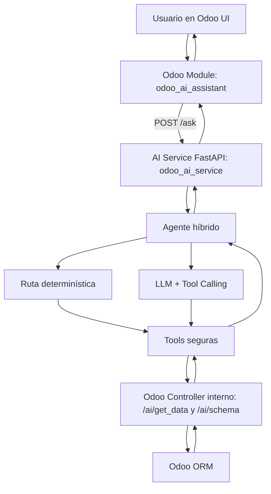

# Odoo Ops Copilot

Hybrid AI agent for Odoo ERP operations that combines deterministic ORM tools with RAG over functional and technical documentation.

It can answer questions about real ERP data, explain business processes, validate operational rules, and provide grounded responses with both Odoo evidence and cited knowledge sources.

Asistente conversacional híbrido para Odoo que permite consultar datos reales del ERP usando lenguaje natural.

En lugar de depender completamente de un LLM, el sistema combina rutas determinísticas, memoria contextual por sesión, validaciones semánticas y tools seguras de solo lectura. Cuando una consulta no puede resolverse por reglas, el agente recurre a un LLM con tool calling controlado.

El objetivo es simple: convertir preguntas de negocio en consultas confiables sobre el ERP, reduciendo tiempo de búsqueda, costo en tokens y errores de interpretación.

---

## Qué hace hoy

- Consulta **ventas, facturas y compras** usando lenguaje natural.
- Resuelve **conteos, listados, rankings y agregaciones**.
- Maneja **follow-ups contextuales** como:
  - `esa venta`
  - `muéstrame sus productos`
  - `¿tiene factura?`
- Pide **aclaraciones** cuando una pregunta es ambigua:
  - `ventas vs facturas`
  - `total vs detalle`
  - `mayor venta individual vs total acumulado`
- Usa **tools controladas** para consultar Odoo sin acceso directo a la base de datos.
- Prioriza **rutas determinísticas** para mejorar latencia, costo y consistencia.

---

## Demo

### Ejemplo 1: aclaración + resolución determinística

**Usuario**
> facturas pendientes este mes

**Asistente**
> ¿Quieres solo el total o quieres ver el detalle?

**Usuario**
> detalle

**Resultado**
> listado determinístico de facturas pendientes del período, consultado directamente desde Odoo.

### Ejemplo 2: consulta analítica

**Usuario**
> Top clientes por facturación

**Asistente**
> 1. Cliente A – 2809  
> 2. Cliente B – 1664  
> 3. Cliente C – 1500

### Ejemplo 3: follow-up contextual

**Usuario**
> dime la mayor venta del último mes

**Asistente**
> ¿Te refieres a la orden de venta individual más alta o al total vendido del período?

**Usuario**
> la venta individual

**Asistente**
> resuelve la orden y la guarda como entidad principal de sesión

**Usuario**
> ¿qué productos se vendieron?

**Asistente**
> consulta directamente las líneas relacionadas sin volver a pedir contexto

---

## Problema

Los ERP como Odoo concentran grandes volúmenes de información, pero obtener respuestas útiles suele requerir:

- navegar múltiples menús
- aplicar filtros manuales
- conocer el modelo exacto y sus relaciones
- construir reportes específicos

Para usuarios de negocio, eso vuelve lenta la obtención de información operativa.  
Y para un enfoque 100% LLM, aparecen otros problemas:

- mayor costo
- más latencia
- más riesgo semántico
- respuestas menos consistentes

---

## Solución

Odoo AI Copilot traduce preguntas de negocio a consultas estructuradas sobre el ERP.

La solución usa un **agente híbrido** que sigue este orden:

1. resuelve aclaraciones pendientes
2. intenta follow-ups por memoria de sesión
3. intenta rutas determinísticas mediante intents y planner
4. si no alcanza, usa LLM con tools controladas

Esto permite reducir la dependencia del modelo y mantener mayor control sobre:

- qué modelo consultar
- qué operación ejecutar
- qué filtros aplicar
- cómo presentar la respuesta

El sistema opera en **modo solo lectura**, con acceso únicamente a operaciones controladas vía ORM de Odoo.

---

## Resultados y mejoras del diseño

La evolución del agente se centró en pasar de un enfoque más dependiente del LLM a uno más controlado y eficiente.

### Mejoras incorporadas

- Separación entre intents de **conteo** y **listado**
- Aclaraciones explícitas para preguntas ambiguas
- Introducción de **semantic frame** antes del planner
- Memoria estructurada con **entidad primaria** y **secundaria**
- Render determinístico para listados y rankings críticos
- Métricas de calidad para detectar errores de fidelidad o consistencia

### Beneficios observados

- Menor uso de tokens en consultas cubiertas por rutas determinísticas
- Menor latencia en conteos, listados simples y agregaciones conocidas
- Menor riesgo de mezclar conceptos como:
  - ventas vs facturas
  - total vs detalle
  - entidad principal vs línea relacionada
- Mayor trazabilidad en el comportamiento del agente

---

## Arquitectura

### Diagrama de arquitectura



### Flujo lógico

1. El usuario consulta desde el módulo `odoo_ai_assistant` en Odoo.
2. Odoo envía la petición al `odoo_ai_service`.
3. El agente intenta resolver la consulta por aclaración, memoria y rutas determinísticas.
4. Si no es suficiente, usa LLM con tool calling controlado.
5. Las tools consultan Odoo mediante `/ai/get_data` y `/ai/schema`.
6. El resultado vuelve al usuario y se actualiza la memoria de sesión.

### Decisiones de diseño

#### Agente híbrido

No todas las preguntas necesitan un LLM.  
El sistema intenta primero rutas determinísticas para mejorar:

- velocidad
- costo
- consistencia
- control semántico

#### Solo lectura

Se priorizó seguridad y confianza operativa antes que acciones transaccionales.  
El agente no crea ni modifica registros.

#### Tools controladas

El LLM no ejecuta código arbitrario ni consulta directamente la base de datos.  
Solo puede usar herramientas explícitas y validadas.

#### Memoria estructurada

La sesión mantiene una memoria mínima para follow-ups, separando:

- `primary_entity`: entidad principal de negocio
- `secondary_entity`: entidad contextual secundaria

Esto reduce errores cuando el usuario hace referencias como:

- `esa venta`
- `esa factura`
- `sus productos`

#### Semantic frame

Antes del planner, la consulta se normaliza en una estructura semántica con:

- acción
- modelo
- filtros
- rango temporal
- agregación
- ordenamiento

Esto mejora la estabilidad de los intents y evita depender del texto libre.

#### Render determinístico

Las respuestas críticas, como listados y rankings, no se dejan a narración libre del LLM.  
Se renderizan de forma determinística para preservar orden, métricas y fidelidad.

---

## Tecnologías

### Backend

- Python
- FastAPI
- Docker
- PostgreSQL

### ERP

- Odoo 18

### IA

- OpenAI API
- GPT-4o mini

---

## Diseño del agente

El agente interactúa con Odoo mediante herramientas especializadas.

### Capacidades actuales

- Memoria estructurada por sesión con entidad primaria/secundaria
- Follow-ups directos y relacionales
- Aclaraciones para consultas ambiguas
- Semantic frame previo al planner
- Render determinístico en casos críticos
- Validación semántica y de schema antes de consultar
- Métricas de calidad por respuesta

### Tools disponibles

#### `query_odoo_search`

Busca registros y devuelve IDs.

#### `query_odoo_read`

Lee campos específicos de registros.

#### `query_odoo_group`

Realiza agregaciones usando `read_group`.

#### `query_odoo_count`

Cuenta registros usando `search_count`.

#### `get_schema`

Obtiene schema resumido por modelo para validar campos antes de consultar.

---

## Memoria y follow-ups

El sistema mantiene una memoria mínima por sesión para conservar contexto útil entre turnos.

### Ejemplo

1. Usuario: `dime la mayor venta del último mes`
2. Agente: `¿Te refieres a la orden de venta individual más alta o al total vendido del período?`
3. Usuario: `la venta individual`
4. Agente: guarda la orden como entidad principal
5. Usuario: `¿qué productos se vendieron?`
6. Agente: consulta directamente las líneas relacionadas

### Estructura usada actualmente

- `primary_entity`: entidad principal de negocio
- `secondary_entity`: entidad secundaria contextual
- `entity follow-up`: relectura de la entidad actual
- `related follow-up`: consulta de modelos relacionados
- `pending clarification`: aclaración pendiente entre turnos

---

## Aclaraciones

Cuando la consulta es ambigua, el agente pide precisión antes de consultar.

### Casos típicos

- `mayor venta`
- `mayor compra`
- `ventas pendientes`
- `facturas pendientes este mes`

### Ejemplos de aclaración

- ¿Te refieres a pedidos de venta o a facturas emitidas?
- ¿Quieres solo el total o quieres ver el detalle?
- ¿Te refieres al registro individual más alto o al acumulado del período?

Esto evita errores semánticos frecuentes y mejora la consistencia del flujo.

---

## Seguridad

El sistema aplica varias restricciones para reducir riesgo operativo:

- acceso limitado a operaciones de lectura
- uso obligatorio de tools controladas
- sin acceso directo a base de datos
- el LLM no recibe credenciales del ERP
- las llamadas al modelo se hacen desde el AI Service, nunca desde el navegador

### Operaciones permitidas

- `search`
- `search_count`
- `read`
- `read_group`

### Recomendaciones de despliegue

- usar secretos en variables de entorno
- rotar API keys
- limitar permisos por modelo según el caso de uso
- revisar record rules y accesos del usuario en Odoo

---

## Instalación

1. Configura las variables de entorno.
2. Levanta los servicios:

```bash
docker compose up -d --build
```

3. En Odoo:
- actualiza la lista de Apps
- instala el módulo AI Assistant (`odoo_ai_assistant`)

### Rebuild de desarrollo

Si solo cambias código del servicio de IA:

```bash
docker compose up -d --build ai_service
```

Si cambias modelos o campos del módulo Odoo, además de rebuild/restart debes actualizar el módulo `odoo_ai_assistant`.

---

## Configuración

El proyecto usa `.env` en la raíz y `config/odoo.conf`.

### Variables mínimas

- `OPENAI_API_KEY`
- `ODOO_BASE_URL`
- `ODOO_DB`

### Variables comunes

- `ODOO_VERSION`
- `ODOO_PORT`
- `ODOO_CONTAINER_NAME`
- `PG_VERSION`
- `PG_PORT`
- `PG_CONTAINER_NAME`
- `PG_USER`
- `PG_PASSWORD`
- `ODOO_SERVER`
- `ODOO_DATA`
- `CUSTOM_ADDONS`
- `ENTERPRISE_ADDONS`

### Variables de control del LLM

- `LLM_MODEL`
- `LLM_MAX_INPUT_TOKENS`
- `LLM_MAX_COMPLETION_TOKENS`
- `LLM_MAX_MESSAGE_CHARS`
- `LLM_MAX_TOOL_CHARS`
- `LLM_TOKEN_CHAR_RATIO`
- `LLM_LOG_TOKEN_USAGE`

### Variables de memoria conversacional

- `MEMORY_STORE`: `in_memory` por defecto; `postgres` para persistencia.
- `MEMORY_TTL_SECONDS`: TTL de la memoria, por defecto `86400`.
- `MEMORY_DATABASE_URL`: conexión PostgreSQL cuando `MEMORY_STORE=postgres`.

La memoria se guarda por `db_name + user_id + session_id` para evitar cruces entre usuarios, sesiones o bases de datos.

### Variables de evaluación

- `EVAL_ENFORCE_LATENCY`: si es `true`, los casos que superen `max_latency_ms` fallan. Por defecto la latencia se reporta como warning para evitar flakiness del proveedor LLM/RAG.
- `AI_EVAL_DB_NAME` / `EVAL_ODOO_DB`: nombre de base usado para aislar memoria en evals reales.

---

## Guía rápida de uso

1. Abre Odoo en tu navegador.
2. Entra al módulo AI Assistant.
3. Escribe una consulta, por ejemplo:
- Lista los clientes
- Top clientes por facturación
- Ventas del último mes
- Facturas pendientes
4. El asistente responderá usando datos reales del ERP.

---

## Métricas de calidad

Además de latencia, tokens y tool calls, el agente registra señales de calidad como:

- `entity_consistent`
- `ranking_preserved`
- `response_faithful`

Estas señales ayudan a evaluar si la respuesta respetó:

- la entidad correcta
- el orden de un ranking
- la fidelidad respecto a los datos consultados

---

## Limitaciones

- Solo lectura
- Requiere el módulo `odoo_ai_assistant`
- No todas las consultas ambiguas tienen todavía una intención determinística dedicada
- Algunas relaciones dependen del modelado particular del cliente en Odoo
- La memoria actual maneja entidad primaria/secundaria, no un grafo completo de múltiples entidades simultáneas
- Consultas temporales dependen del uso correcto de campos como `date_order` o `invoice_date`

### Trade-offs

- Se priorizó seguridad y control antes que escritura sobre el ERP
- Se favorecen respuestas determinísticas en casos críticos, aunque eso reduce flexibilidad en algunos escenarios
- Algunas consultas complejas aún pueden requerir LLM cuando no existe intent dedicado
- La precisión final depende tanto del diseño del agente como de la calidad del modelo de datos en Odoo

---

## Estructura del proyecto

```text
.
├── addons/
│   ├── custom_addons/
│   │   └── odoo_ai_assistant/
│   │       ├── __manifest__.py
│   │       ├── controllers/
│   │       │   └── chat_controller.py
│   │       ├── models/
│   │       │   ├── chat_ui.py
│   │       │   ├── model.py
│   │       │   ├── schema_cache.py
│   │       │   ├── session_memory.py
│   │       │   └── settings.py
│   │       ├── security/
│   │       │   ├── ai_chat_rules.xml
│   │       │   └── ir.model.access.csv
│   │       ├── static/src/
│   │       │   ├── css/chat.css
│   │       │   └── js/chat.js
│   │       └── views/
│   │           ├── chat_context_buttons.xml
│   │           ├── chat_view.xml
│   │           └── settings_view.xml
│   └── ... (otros addons de negocio)
├── odoo_ai_service/
│   ├── AGENT_STATE.md
│   ├── main.py
│   ├── llm/
│   │   └── llm_client.py
│   ├── schemas/
│   │   └── chat_schema.py
│   ├── tools/
│   │   ├── odoo_get_tool.py
│   │   └── tool_definitions.py
│   ├── agents/
│   │   ├── assistant_agent.py
│   │   └── agent/
│   │       ├── assistant_agent.py
│   │       ├── clarification_resolver.py
│   │       ├── memory_store.py
│   │       ├── reference_resolver.py
│   │       ├── execution/
│   │       │   ├── result_compressor.py
│   │       │   ├── session_state.py
│   │       │   └── tool_executor.py
│   │       ├── intents/
│   │       │   ├── defaults.py
│   │       │   ├── intent_catalog.py
│   │       │   ├── intent_matcher.py
│   │       │   ├── planner.py
│   │       │   └── semantic_frame.py
│   │       ├── metrics/
│   │       │   └── telemetry.py
│   │       ├── validators/
│   │       │   ├── domain_validator.py
│   │       │   ├── schema_validator.py
│   │       │   └── semantic_validator.py
│   │       └── prompts/
│   ├── tests/
│   │   ├── test_clarification_resolver.py
│   │   ├── test_deterministic_render.py
│   │   ├── test_memory_store.py
│   │   ├── test_metrics.py
│   │   ├── test_reference_resolver.py
│   │   └── test_semantic_frame.py
│   ├── parse_metrics.py
│   ├── Dockerfile
│   └── requirements.txt
├── config/
├── data/
├── db/
└── docker-compose.yaml
```

---

## Troubleshooting

### 404 en `/ai/get_data`

Verifica que el módulo `odoo_ai_assistant` esté instalado y reinicia Odoo.

### Invalid field

Ajusta el dominio o usa el campo correcto del modelo.

### Permisos insuficientes

Revisa accesos del usuario y uso de `sudo()` cuando corresponda.

### Base de datos incorrecta

Verifica `ODOO_DB` y la existencia real de la BD.

### Rate limit (429)

Reduce tokens de entrada, limita resultados o favorece agregaciones.

### La tool elegida no es la correcta

Revisa intents, planner y ejemplos del agente.

### La aclaración se repite

Verifica persistencia correcta de memoria de sesión.

### El follow-up no usa memoria

Verifica `chat_session_key` y reenvío de memoria entre requests.

### No encuentra productos o facturas relacionadas

Revisa si las relaciones asumidas por el agente coinciden con el modelo real del cliente.

### Timeout entre Odoo y AI Service

Aumenta timeout HTTP o reduce complejidad de la consulta.

### En rankings usa `*_count` en lugar de la métrica esperada

Revisa que `fields`, `orderby` y render estén alineados con la métrica real.

---

## Roadmap

- Más intenciones determinísticas para consultas ambiguas
- Más resolutores relacionales basados en memoria
- Mejor render de negocio para estados, montos y fechas
- Métricas más finas de fidelidad y consistencia
- Caching de resultados
- Integración MCP (Model Context Protocol)

---

## License

Licensed under the Apache License 2.0. See `LICENSE`.
